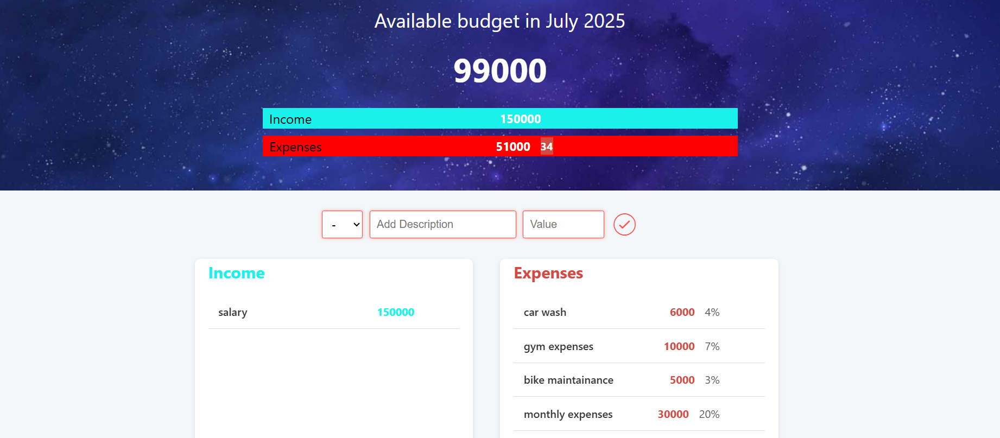

# Budgety – Personal Budget Manager 💸

A simple and interactive budgeting app that helps you manage your **income** and **expenses** in real time.



## 🧰 Tech Stack

- **HTML**
- **CSS**
- **JavaScript (Vanilla)**

## ✨ Features

- Add income and expense entries
- Automatically calculates and updates your budget
- Displays percentage of expenses
- Real-time UI updates
- Clean and responsive layout
- Month/year auto-display

## 🚀 Getting Started

1. Clone the repository:
   ```bash
   git clone https://github.com/hitesh9822/personal-budget-manager.git
